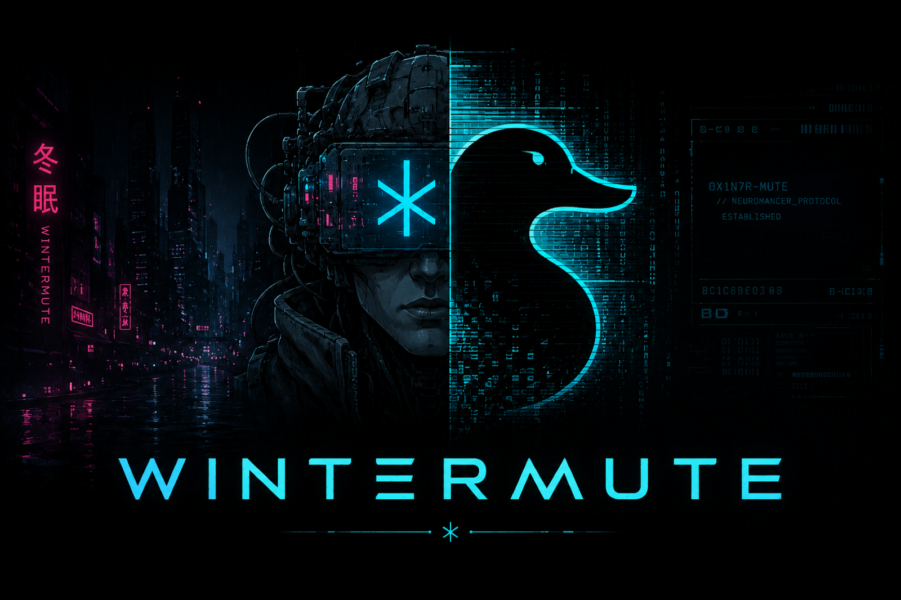

# Project Wintermute

  

  <strong>Black Duck in. Coordinated security workflows out.</strong>
    
  <em>Designed to accelerate Black Duck adoption - from initial visibility to repeatable, automated remediation workflows.</em>

---
Wintermute turns Black Duck SCA data into one normalized, checksum-protected cohort that can drive Jira, Datadog, and future integrations. It discovers parent and child project lineage, collects each affected project version once, preserves product context, and gives every destination a consistent security snapshot without repeatedly loading Black Duck.

It is built for enterprise engineering teams: concurrent collection, deterministic identities, persistent caching, destination-scoped credentials, dry-run-first publishing, non-root containers, and Kubernetes cohort orchestration using Argo. Jira produces vulnerability-remediation hierarchies, while Datadog produces concise high-risk vulnerability events from the same underlying findings.

Chewed & published representative large-instance cold run in about 6 minutes (down from 17 minutes) while preserving the same relationships, findings, and Jira hierarchy. The cohort model also separates Black Duck collection from destination delivery, so integrations can evolve independently without duplicating source logic.

## Quick start

<pre>
python3.12 -m virtualenv .venv
source .venv/bin/activate
python -m pip install -e .
blackduck-wintermute-pull --help
</pre>

For production deployment, start with the [cohort deployment guide](READMEs/COHORT_DEPLOYMENT_README.md). Existing Jira and Datadog commands remain available as compatibility workflows.

> Wintermute is an unofficial personal project and is not supported by Black Duck. Validate dry-run output and customer configuration before enabling destination changes. Contribution is welcomed.
